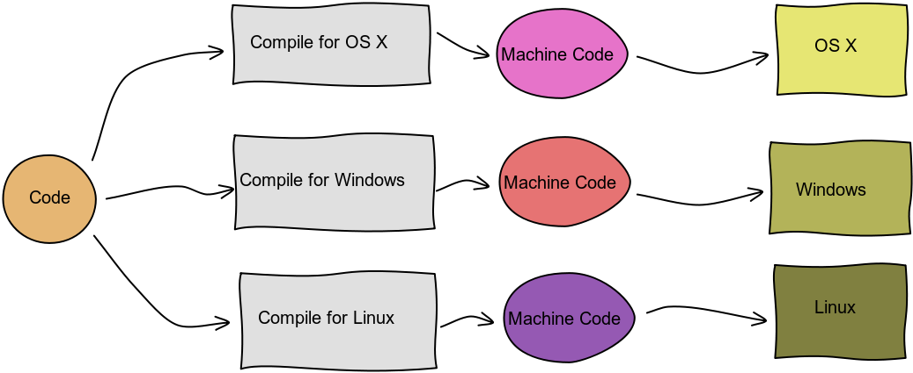
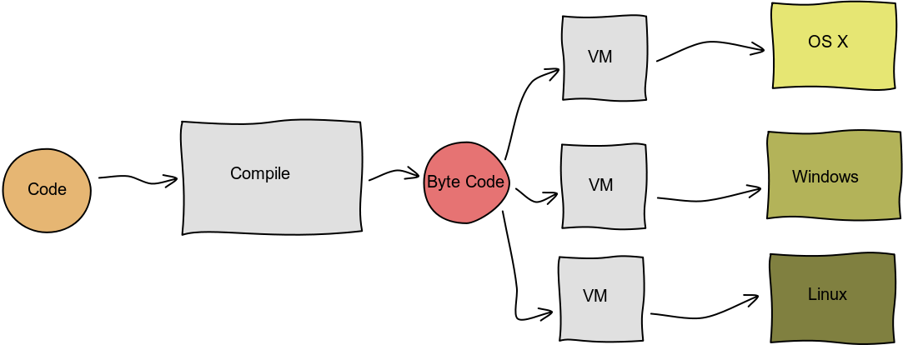
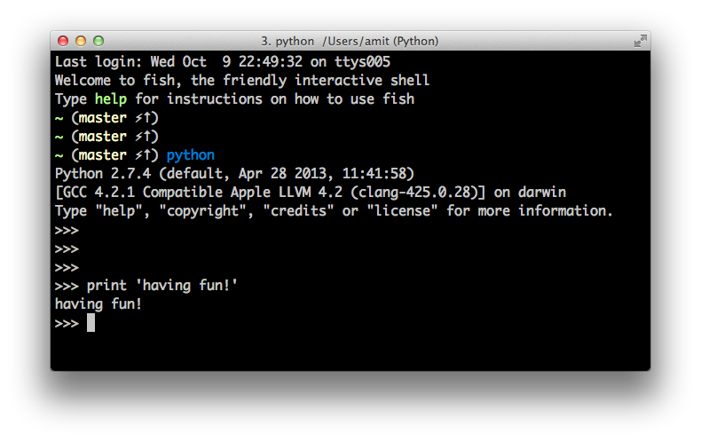

# Python Basics

<br/>
[ Amit Kotlovski ](mailto:amit@amitkot.com) / [ @amitkot ](http://twitter.com/amitkot)


# Agenda

- The Python Interpreter
- Python Script Anatomy
- Code Blocks
- Line End
- Python Identifier Rules


## Compiled Code



## Byte Code



## The Interpreter



## Anatomy of a Script


```python
#!/usr/bin/python
```
```python
import datetime
```
```python
class ArgumentsPrinter(object):
    def __init__(self, name):
        self._name = name

    def print_time(self):
        time = datetime.datetime.now()
        print 'Hi ' + self._name + ', the time is ' + str(time)
```
```python
if __name__ == '__main__':
    ap = ArgumentsPrinter('Dan')
    ap.print_time()
```


## The Hash Bang Line

```python
#!/usr/bin/python
```


## Imports

```python
import datetime
```


## Defining Classes

```python
class ArgumentsPrinter(object):
    def __init__(self, name):
        self._name = name

    def print_time(self):
        time = datetime.datetime.now()
        print 'Hi ' + self._name + ', the time is ' + str(time)
```


## The `main`

```python
if __name__ == '__main__':
    ap = ArgumentsPrinter('Dan')
    ap.print_time()
```


## All Together Now

```python
#!/usr/bin/python
```
```python
import datetime
```
```python
class ArgumentsPrinter(object):
    def __init__(self, name):
        self._name = name

    def print_time(self):
        time = datetime.datetime.now()
        print 'Hi ' + self._name + ', the time is ' + str(time)
```
```python
if __name__ == '__main__':
    ap = ArgumentsPrinter('Dan')
    ap.print_time()
```


## Code Blocks
### C-based Languages

    if (i==5) {
        printf("It is five");
        printf("It is not six");
    }
Same as:

    if (i==5)
    {
        printf("It is still five");
        printf("Still not six");
    }


## C-based Languages

- Blocks are wrapped inside `{}` signs
- Statements end with `;` signs
- Indentation is recommended, technically optional


## C-based Languages
### Advantages

- <span class="fragment">Very common</span>
- <span class="fragment">Leaves room for personal preference</span>
- <span class="fragment">`{}` aren't required for single lines (never omit them!)</span>


## C-based Languages
### Disadvantages: No single standard

    if (i<3) printf('Small');

    if (i<3) {              // Same
        printf('Small');
    }

    if (i<3)                // Same
    {
    printf('Small');
    }


## C-based Languages
### Disadvantages: Code can get ugly\unreadable and still work

    if (i==5) {
    printf("Still is five");     // No indentation
    printf("Not six"); }


## C-based Languages
### Disadvantages: Errors lead to unexpected behaviour

    if (i==5)
        printf("Only for five");
        printf("always");           // always printed


## In Python
### Indentation determines code blocks

    if i==5:
        print("five in python")
        print("not six")


# End Of Line


## C-Based Languages
### The line ends with a Semicolon symbol

    if (i==5) {
        printf("It is five");
        printf("It is not six");
    }


## In Python
### The line ends when you start a new one

    if i==5:
        print('It is five')
        print('It is not six')


## No Symbol for end of line
### Advantages
- Less 'dirt' around your code
- More elegant code
- Certain bugs are avoided


## No Symbol for end of line
### Problem - Very long line of code

```python
x = max(len([1, 2, 3, 4]), len([7])) + min(len([11, 12]), len([]))
```


## No Symbol for end of line
### Solution 1 - Smaller parts

```python
a = [1, 2, 3, 4])
b = [7]
c = [11, 12]
d = []
x = max(len(a), len(b)) + min(len(c), len(d))
```


## No Symbol for end of line
### Solution 2 - Inside `()`

```python
x = max(len([1, 2, 3, 4]), len([7])) + min(len([11, 12]), 
                                           len([]))
```


## No Symbol for end of line
### Solution 3 - Use `\`

```python
x = max(len([1, 2, 3, 4]), len([7])) + \
    min(len([11, 12]), len([]))
```


## Python Identifier Rules
### Class, Function and Variable Names

- Starts with a letter or \_
- Continues with letters, digits or more \_ chars
- Identifier is case sensitive


## Python Identifier Rules

Valid:

- `cat`
- `dog3`
- `__banana`
- `a___`
- `_ (avoid)`
- `random_number`


## Python Identifier Rules

Invalid:

- `3crocodile`
- `star@david`


## Python Identifier Rules
### Quiz

Are these valid?

- `sesame`
- `_32_`
- `32`
- `_`


# Summary

- The Python Interpreter handles scripts and live sessions
- Scripts have parts
- Python code is pretty!
- Python code (usually ) needs no line ends


# Questions


# Thanks!

[ Amit Kotlovski ](mailto:amit@amitkot.com) / [ @amitkot ](http://twitter.com/amitkot)
