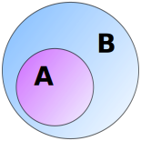

# Types

<br/>
[ Amit Kotlovski ](mailto:amit@amitkot.com) / [ @amitkot ](http://twitter.com/amitkot)


# Agenda

- Numbers
- Strings
- Tuples
- Lists
- Sets
- Dictionaries


# Tuples


## Features

- Holds a sequence of items
- Similar to `list` but immutable


## Creating a tuple
### From scratch
```python
>>> t1 = (1, 2, 3)
>>> t1
(1, 2, 3)
>>> t2 = (1,)
>>> t2
(1,)
>>> t3 = 1,
>>> t3
(1,)
```


## Creating a tuple
### Converting a list

```python
>>> a = [1, 2, 3]
>>> tuple(a)
(1, 2, 3)
```


## Immutable Container

Once created, a tuple does not change:

```python
>>> t = (1, 2, 3)
>>> t
(1, 2, 3)
>>> t.add(4)
Traceback (most recent call last):
  File "<stdin>", line 1, in <module>
AttributeError: 'tuple' object has no attribute 'add'
```


## Immutable Container

Keeping a mutable object inside a tuple allows mutations of that object

```python
>>> a = [1, 2, 3]
>>> t = ('first', a, 'last')
>>> t
('first', [1, 2, 3], 'last')
>>> t[1].append('banana')
>>> t
('first', [1, 2, 3, 'banana'], 'last')
```


## Slicing

Accessing a single item

```python
# third index
>>> t = ('Atreides', 'Ordos', 'Harkonnen')
>>> t[2]
'Harkonnen'

# last index
>>> t[-1]
'Harkonnen'
```


## Slicing

Slicing a range

```python
>>> t = ('Atreides', 'Ordos', 'Harkonnen')
>>> t[0:2]
('Atreides', 'Ordos')
```


## Slicing - Full syntax

---
`slice = tuple_name[start:end:step]`
<br/>
<br/>
Parameter | Description
--- | ---
`start` | first index of the slice
`end` | the index __after__ the last index of the slice
`step` | the step to take between each item in the slice

---
<br/>
Example - Slicing a range with a step of 2

```python
>>> t = (0, 1, 2, 3, 4, 5, 6, 7, 8)
>>> t[2:8:2]
(2, 4, 6)
```


## Slicing - Quiz

How will we slice backwards from the item at location 8 until the item at
location 2 with a step of 2?

```python
>>> t = (0, 1, 2, 3, 4, 5, 6, 7, 8)
```


## Useful Operations

- Packing and Unpacking
- Swapping
- Adding
- Multiplying
- Length


### Packing and Unpacking

Packing

```python
>>> a = 1
>>> b = 2
>>> c = 3
>>> t = a, b, c
```

Unpacking

```python
>>> t = (5, 6, 7)
>>> a, b, c = t
>>> print(a, b, c)
5 6 7
```


### Swapping

How would you swap values between two variables?


### Swapping - Using a Temporary variable

```python
>>> a = 5
>>> b = 500
>>> print(a, b)
5 500
>>> temp = a
>>> a = b
>>> b = temp
>>> print(a, b)
500 5
```


### Swapping - Using Tuples

```python
>>> a = 33
>>> b = 111
>>> print(a, b)
33 111
>>> a, b = b, a     # Packing and Unpacking
>>> print(a, b)
111 33
```


### Adding

Adding tuples concatenates them

```python
>>> t1 = ('a', 'b')
>>> t2 = (99, 256)
>>> t1 + t2
('a', 'b', 99, 256)
```


### Multiplying

Multiplying tuples is adding them to themselves

```python
>>> t = ('a', 'b')
>>> 3 * t
('a', 'b', 'a', 'b', 'a', 'b')
>>> t * 3
('a', 'b', 'a', 'b', 'a', 'b')
```


### Length

Using the `len()` function we previously met

```python
>>> t1 = ('a', 'b')
>>> t2 = (99, 256)
>>> len(t1 + t2)
4
```


# Questions


# Lists


## Adding to List
### Appending to end of list

```python
>>> simpsons = ['Homer', 'Marge', 'Lisa', 'Maggie']
>>> simpsons.append("Santa's Little Helper")
>>> simpsons
['Homer', 'Marge', 'Lisa', 'Maggie', "Santa's Little Helper"]
```


## Adding to List
### Inserting __before__ a specific position

```python
>>> simpsons
['Homer', 'Marge', 'Lisa', 'Maggie', "Santa's Little Helper"]
>>> simpsons.insert(2, 'Bart')
>>> simpsons
['Homer', 'Marge', 'Bart', 'Lisa', 'Maggie', \
 "Santa's Little Helper"]
```


## Adding to List
### Example: Inserting at the beginning of the list

```python
>>> simpsons.insert(0, 'Abraham')
>>> simpsons
['Abraham', 'Homer', 'Marge', 'Bart', 'Lisa', 'Maggie', \
 "Santa's Little Helper"]
```


## Remove
### by Position

Default index is last item:
```python
>>> simpsons
['Abraham', 'Homer', 'Marge', 'Bart', 'Lisa', 'Maggie', \
 "Santa's Little Helper"]
>>> person = simpsons.pop()     # pop last item
>>> person
"Santa's Little Helper"
>>> simpsons
['Abraham', 'Homer', 'Marge', 'Bart', 'Lisa', 'Maggie']
```

Specifying index for pop:
```python
>>> person = simpsons.pop(0)    # pop at a specified index
>>> person
'Abraham'
>>> simpsons
['Homer', 'Marge', 'Bart', 'Lisa', 'Maggie']
```


## Remove
### by Content

```python
>>> simpsons
['Homer', 'Marge', 'Bart', 'Lisa', 'Maggie']
>>> simpsons.remove('Lisa')
>>> simpsons
['Homer', 'Marge', 'Bart', 'Maggie']
```

It removes only the first occurrence:
```python
>>> cats = ['Snowball', 'Snowball II', 'Snowball III', \
            'Coltrane', 'Snowball II']
>>> cats.remove('Snowball II')
>>> cats
['Snowball', 'Snowball III', 'Coltrane', 'Snowball II']
```


## Sort
### In Place

Strings:
```python
>>> baratheon = ['Robert', 'Stannis', 'Renly']
>>> baratheon.sort()
>>> baratheon
['Renly', 'Robert', 'Stannis']
```

Numbers:
```python
>>> numbers = [20, 500, 1, 17.3]
>>> numbers.sort()
>>> numbers
[1, 17.3, 20, 500]
```

Reverse Sort:
```python
>>> numbers = [20, 500, 1, 17.3]
>>> numbers.sort(reverse=True)
>>> numbers
[500, 20, 17.3, 1]

```


## Sort
### Mixing different types?

`mixed = [1, '2', [3, 4]]`

Can we run `mixed.sort()`?

<br/>
##<span class='fragment'>Python 2 - _Yeah, OK_</span>

##<span class='fragment'>Python 3 - _Nope_</span>


## Sort
### Not In Place

```python
>>> numbers = [20, 500, 1, 17.3]
>>> sorted_numbers = sorted(numbers)
>>> numbers         # did not change
[20, 500, 1, 17.3]
>>> sorted_numbers  # sorted
[1, 17.3, 20, 500]
```


## List Methods


### Clear The List

```python
>>> numbers = [20, 500, 1, 17.3]
>>> numbers.clear()
>>> numbers
[]
```


### Counting Occurrences

```python
>>> numbers = [20, 500, 1, 17.3, 20]
>>> numbers.count(20)
2
```


### Extending The List

```python
>>> numbers = [20, 500, 1, 17.3]
>>> more_numbers = [999, 888, 777]
>>> numbers.extend(more_numbers)
>>> numbers
[20, 500, 1, 17.3, 999, 888, 777]
```

Can also be achieved using `+`:

```python
>>> numbers = [20, 500, 1, 17.3]
>>> more_numbers = [999, 888, 777]

>>> numbers + more_numbers
[20, 500, 1, 17.3, 999, 888, 777]
```


### Finding An Item's Index

```python
>>> numbers = [20, 500, 1, 17.3, 6, 17.3]
>>> numbers.index(17.3)
3
```


### Reversing the List's Order

```python
>>> numbers = [20, 500, 1, 17.3]
>>> numbers.reverse()
>>> numbers
[17.3, 1, 500, 20]
```


# Questions


# Sets


## Basics


### Creating a new Set

```python
>>> s = {'once', 'once', (1, 2), 5.17}
>>> s
{(1, 2), 'once', 5.17}
```


### Creating a Set from a List

```python
>>> l = ['once', 'once', (1, 2), 5.17]
>>> l
['once', 'once', (1, 2), 5.17]
>>> s = set(l)
>>> s
{'once', (1, 2), 5.17}
```


### Adding an item

```python
>>> s
{'once', (1, 2), 5.17}
>>> s.add('banana')
>>> s
{'once', (1, 2), 5.17, 'banana'}
```


### Removing an Item

```python
>>> s
{'once', (1, 2), 5.17, 'banana'}
>>> s.remove('banana')
>>> s
{'once', (1, 2), 5.17}
```


## Set Uses


### Remove Duplicate Items in List

```python
>>> l = ['first', 'second', 'second', 'second', 'third']
>>> set(l)
{'second', 'first', 'third'}
```


### Intersection


```python
>>> sweet = {'jam', 'sugar', 'banana', 'mango'}
>>> yellow = {'mustard', 'lemon', 'banana', 'mango'}
>>> sweet.intersection(yellow)
{'mango', 'banana'}
>>> sweet & yellow              # short syntax
{'mango', 'banana'}
```


### Union


```python
>>> sweet = {'jam', 'sugar', 'banana', 'mango'}
>>> yellow = {'mustard', 'lemon', 'banana', 'mango'}
>>> sweet.union(yellow)
{'mustard', 'banana', 'jam', 'sugar', 'lemon', 'mango'}
>>> sweet | yellow              # short syntax
{'mustard', 'banana', 'jam', 'sugar', 'lemon', 'mango'}
```


### Difference


```python
>>> sweet = {'jam', 'sugar', 'banana', 'mango'}
>>> yellow = {'mustard', 'lemon', 'banana', 'mango'}
>>> sweet.difference(yellow)
{'sugar', 'jam'}
>>> sweet - yellow              # short syntax
{'sugar', 'jam'}
```


### Symmetric Difference


```python
>>> sweet = {'jam', 'sugar', 'banana', 'mango'}
>>> yellow = {'mustard', 'lemon', 'banana', 'mango'}
>>> sweet.symmetric_difference(yellow)
{'jam', 'sugar', 'mustard', 'lemon'}
>>> sweet ^ yellow              # short syntax
{'jam', 'sugar', 'mustard', 'lemon'}
```


### Subset\Superset


```python
>>> yellow_fruits = {'banana', 'mango'}                 # A
>>> yellow = {'mustard', 'lemon', 'banana', 'mango'}    # B
>>> yellow_fruits.issubset(yellow)
True
>>> yellow_fruits < yellow      # short syntax
True

>>> yellow.issuperset(yellow_fruits)
True
>>> yellow > yellow_fruits      # short syntax
True
```


### Disjoint


```python
>>> sweet = {'jam', 'sugar', 'banana', 'mango'}
>>> cars = {'Toyota', 'Mazda', 'Ford'}
>>> sweet.isdisjoint(cars)
True
```


## Set Operations


### `copy()`

Copies the Set to a new separate one

```python
>>> sweet = {'jam', 'sugar', 'banana', 'mango'}
>>> tastes = sweet.copy()
>>> sweet = {'jam', 'sugar', 'banana', 'mango'}
>>> has_taste = sweet.copy()
>>> has_taste.add('lemon')              # add to _new_ Set
>>> has_taste
{'mango', 'banana', 'sugar', 'jam', 'lemon'}
>>> sweet                               # did not change
{'jam', 'mango', 'sugar', 'banana'}
```


### `discard()`

Removes an item from the Set, if it's there. Does not report error if not there.

```python
>>> sweet = {'jam', 'sugar', 'banana', 'mango'}
>>> sweet.discard('sugar')          # removes 'sugar'
>>> sweet.discard('watermelon')     # item not in Set, ignores the error
>>> sweet
{'jam', 'mango', 'banana'}
```


### `pop()`

Extracts _some_ item from the Set

```python
>>> sweet = {'sugar', 'banana', 'mango', 'jam'}
>>> sweet.pop()
'mango'
```


### `clear()`

Remove all items from the Set

```python
>>> sweet = {'jam', 'sugar', 'banana', 'mango'}
>>> sweet.clear()
>>> sweet
set()
```


# Questions


# Dictionaries


## Dictionary Creation

```python
>>> eye = {'David': 'brown', 'Ron': 'black', 'Bill': 'blue'}
>>> d
{'Bill': 'blue', 'David': 'brown', 'Ron': 'black'}
```

Equivalent to:
```python
>>> e = dict()
>>> e['David'] = 'brown'
>>> e['Ron'] = 'black'
>>> e['Bill'] = 'blue'
>>> e
{'Bill': 'blue', 'David': 'brown', 'Ron': 'black'}
```


## Keys & Values


### Key - immutable

- number
- string
- tuple


### Value - Any Type

- immutable types
- lists
- sets
- dictionaries
- user-created types (we'll soon meet)


### Quiz

What will this dictionary contain?

```python
>>> d = {'first': 'drink', 'first': 'eat'}
```


## Adding, Getting and Removing


### Adding

```python
>>> eye = {'David': 'brown', 'Ron': 'black', 'Bill': 'blue'}
>>> eye['Daenerys'] = 'violet'
>>> eye
{'Bill': 'blue', 'David': 'brown', 'Daenerys': 'violet', 
 'Ron': 'black'}
```


### Get Value by Key

Method | Returns
--|--
d[_key_] | value for _key_, error if does not exist
get(key, default_val) | value for _key_ if exists, _default_val_ otherwise

```python
>>> eye = {'David': 'brown', 'Ron': 'black', 'Bill': 'blue'}
>>> eye['Ron']
'black'
>>> eye.get('Ron')
'black'
>>> eye.get('Owen', 'gold')     # Providing default value
'gold'
```


### Remove - `del`

```python
>>> eye = {'David': 'brown', 'Ron': 'black', 'Bill': 'blue'}
>>> del eye['David']
>>> eye
{'Bill': 'blue', 'Ron': 'black'}
```


### Remove - `pop()`

Extract an item, return it and remove it from the Dictionary:
```python
>>> eye = {'David': 'brown', 'Ron': 'black', 'Bill': 'blue'}
>>> bill_eye = eye.pop('Bill')
>>> bill_eye
'blue'
>>> eye
{'David': 'brown', 'Ron': 'black'}
```

Providing a default value, in case the key does not exist:

```python
>>> eye.pop('George', 'green')
'green'
>>> eye
{'David': 'brown', 'Ron': 'black'}
```


### Remove - `popitem()`

Pop _some_ item from the Dictionary:

```python
>>> eye = {'David': 'brown', 'Ron': 'black', 'Bill': 'blue'}
>>> eye.popitem()
('Bill', 'blue')
```


## Dictionary Methods


### is Key in Dictionary?

```python
>>> eye = {'David': 'brown', 'Ron': 'black', 'Bill': 'blue'}
>>> 'Ron' in eye
True
>>> 'Jon' not in eye
True
```


### `clear()`

```python
>>> eye
{'Bill': 'blue', 'David': 'brown', 'Ron': 'black'}
>>> eye.clear()
>>> eye
{}
```


### `copy()`

```python
>>> eye = {'David': 'brown', 'Ron': 'black', 'Bill': 'blue'}
>>> eye_same = eye
>>> eye_backup = eye.copy()
>>> eye['David'] = 'RED'
>>> eye
{'Bill': 'blue', 'David': 'RED', 'Ron': 'black'}
>>> eye_same
{'Bill': 'blue', 'David': 'RED', 'Ron': 'black'}
>>> eye_backup
{'Bill': 'blue', 'David': 'brown', 'Ron': 'black'}
```


### `keys()`, `values()` and `items()`

A direct connection to the actual keys, values and items:

```python
>>> eye = {'David': 'brown', 'Ron': 'black', 'Bill': 'blue'}
>>> k = eye.keys()
>>> v = eye.values()
>>> i = eye.items()
```

Changes to the dictionary affect them:

```python
>>> eye['Sarah'] = 'green'
>>> k
dict_keys(['Bill', 'David', 'Sarah', 'Ron'])
>>> v
dict_values(['blue', 'brown', 'green', 'black'])
>>> i
dict_items([('Bill', 'blue'), ('David', 'brown'), 
            ('Sarah', 'green'), ('Ron', 'black')])
```


# Summary

- __Tuples__ are immutable lists
- __Lists__ are ordered data collections with sort, find and more
- __Sets__ are collections with no duplicate items
- __Dictionaries__ map keys to values


# Questions


# Thanks!

[ Amit Kotlovski ](mailto:amit@amitkot.com) / [ @amitkot ](http://twitter.com/amitkot)

All Rights Reserved to Amit Kotlovski
