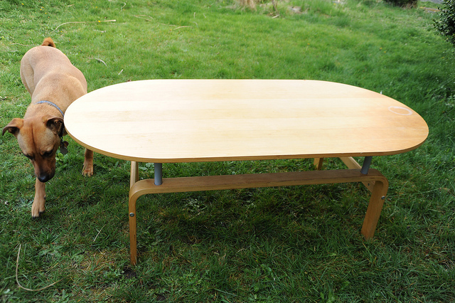

# Classes

<br/>
[ Amit Kotlovski ](mailto:amit@amitkot.com) / [ @amitkot ](http://twitter.com/amitkot)


# Agenda

- Introduction
- Defining new Classes
- Class methods
- Constructor method
- Class inheritance
- Special Methods
- Properties
- Documentation


# Introduction




## Defining New Classes

```python
class LivingRoomTable(object):
    pass

>>> t = LivingRoomTable()
```


## Defining a Typical new Class

```python
class LivingRoomTable(object):
    def __init__(self, size, height, color):
        self._size = size
        self._height = height
        self._color = color

    def is_high(self):
        return self._height > 50
```
```python
>>> t = LivingRoomTable(120, 40, 'mahogany')
>>> print 'is it high?', t.is_high()
is it high? False
```


## Class Methods

```python
class LivingRoomTable(object):
    def __init__(self, size, height, color):
        self._size = size
        self._height = height
        self._color = color

    def default_height(self):
        return 50

    def is_high(self):
        return self._height > self.default_height()
```
```python
>>> t = LivingRoomTable(120, 40, 'mahogany')
>>> print 'is it high?', t.is_high()
is it high? False
```


## Constructor Method

```python
class LivingRoomTable(object):
    def __init__(self, size, height, color):
        self._size = size
        self._height = height
        self._color = color
    .
    .
    .
```

```python
>>> t = LivingRoomTable(120, 40, 'mahogany')
```


## Method Name


## Method Name
### _name - One Underscore Prefix


## Method Name
### name_ - One Underscore Suffix


## Method Name
### __name - Two Underscore Prefix

```python
class A(object):
    def __b(self):
        return 42
    def c(self):
        return self.__b()
```
```python
>>> a = A()
>>> a.__b()
AttributeError: A instance has no attribute '__b'

>>> a.c()
42

>>> a._A__b()
42
```


## Method Name
### \_\_name\_\_ - Two Underscore Prefix and Suffix

"Magic" names for interacting with Python Framework

```python
class A(object):
    def __len__(self):
        return 42
```
```python
>>> a = A()
>>> len(a)
42

>>> a.__len__()
42
```


## "Magic" Methods


## `__len__`

The magic behind `len()` for getting object length
```python
>>> l = [1, 2, 3, 4]
>>> print len(l)
4
>>> # is equal to:
>>> print l.__len__()
4
```


## `__str__`

The magic behind `str()` for getting string representation
```python
>>> l = [1,2,    3,  2+2]
>>> print str(l)
[1, 2, 3, 4]
# is equal to:
>>> print l.__str__()
[1, 2, 3, 4]
```


## Operator Overloading

```python
class FunnyString(object):
    def __init__(self, string):
        self._data = string
    def __str__(self):
        return self._data
    def __pos__(self):
        return self._data.upper()
    def __neg__(self):
        return self._data.lower()
```
```python
>>> fs = FunnyString("This is THE funniest string ever!")
>>> print fs
This is THE funniest string ever!
>>> print +fs
THIS IS THE FUNNIEST STRING EVER!
>>> print -fs
this is the funniest string ever!
```


## Class Inheritance

```python
class Table(object):
    def number_of_legs(self):
        return 4

class LivingRoomTable(Table):
    def used_for(self):
        return 'holding coffee cups'

```
```python
>>> table = LivingRoomTable()
>>> print table.number_of_legs()
4
```


## Inheriting from object

If there is no need to inherit, inherit from object

```python
class Table(object):
    def number_of_legs(self):
        return 4
```


## `super()`

```python
class C(B):
    def method(self, arg):
        super(C, self).method(arg)
```

For example:
```python
class LivingRoomTable(Table):
    def __init__(self, height, color, location):
        super(LivingRoomTable, self).__init__(height, color)
        self._living_room_location = location
```


## Problem - Accessing class member variables directly

From outside the class

```python
class Table(object):
    def __init__(self, height):
        self.height = height
```
```python
>>> t = Table(50)
>>> t.height = 700
>>> print t.height
700
```


### Accessing class member variables directly

- ⬆ Very comfortable
- ⬇ Breaks encapsulation 
- ⬇ Exposes internal implementation


## Common solution - getters and setters

```python
class Table(object):
    def __init__(self, height):
        self._height = height
    def get_height(self):
        return self._height
    def set_height(self, val):
        self._height = val
```
```python
>>> t = Table(50)
>>> t.set_height(700)
>>> print t.get_height()
700
```


## Getters and Setters

- ⬆ Exposes the data while hiding implementation
- ⬇ Annoying to implement


## Properties

```python
class Table(object):
    def __init__(self):
        self._color = None

    def getcolor(self):
        return self._color

    def setcolor(self, value):
        self._color = value

    color = property(getcolor, setcolor)
```
Now we can access t.color:
```python
>>> t = Table()
>>> t.color = 'Blue'
>>> print t.color
Blue
```


## Property Decorator

```python
class Table(object):
    def __init__(self):
        self._color = None

    @property
    def color(self):
        return self._color

    @color.setter
    def color(self, value):
        self._color = value
```
Accessing t.color:
```python
>>> t = Table()
>>> t.color = 300
>>> print t.color
300
```


## Docstring

```python
class Table(object):
    """ The Table class represents a table with a certain height.

    The Table class is a wonderful example for a well documented class.
    It currently provides no methods, but if it had any - they would 
    have been documented here.

    """

    def __init__(self, height):
        self.height = height
```


# Summary

- Group together relevant values and functionality
- Support multiple inheritance
- Allow implementation of "special" methods
- Regulate access to members using properties


# Questions


# Thanks!

[ Amit Kotlovski ](mailto:amit@amitkot.com) / [ @amitkot ](http://twitter.com/amitkot)
